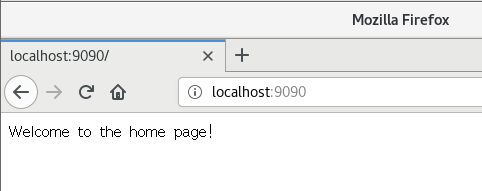
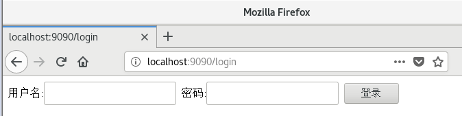
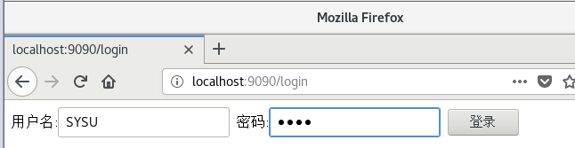
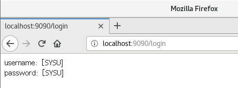

# [服务计算] 开发web服务程序cloudgo

## 项目概述

开发简单 web 服务程序 cloudgo，了解 web 服务器工作原理。

***

## 作业要求

1. 编程 web 服务程序 类似 cloudgo 应用。
   - 要求有详细的注释
   - 是否使用框架、选哪个框架自己决定 请在 README.md 说明你决策的依据

2. 使用 curl 测试，将测试结果写入 README.md

3. 使用 ab 测试，将测试结果写入 README.md。并解释重要参数。

***

## 运行环境

- Linux Centos7
- Golang

***

## 使用框架说明

- net/http

> Go语言里面提供了一个完善的net/http包，通过http包可以很方便的搭建起来一个可以运行的Web服务。同时使用这个包能很简单地对Web的路由，静态文件，模版，cookie等数据进行设置和操作。


- negroni库

> Negroni中间件库，是一个非常经典的库，非常小，但是功能强大，因为他定义了中间件的框架和风格，让我们可以基于它开发出我们自己的中间件，并且可以集成到Negroni中。
>
> Negroni还兼容原生的http.Handler,你完全可以把自己的http.Handler加入到Negroni的中间件链中，Negroni会自动调用他们处理我们的HTTP Request的。


## 运行说明

### 运行

进入项目根目录：`$GOPATH/src/cloudgo`

```bash
go run main.go -p 9090
```

### 效果

打开浏览器

1.

访问地址：

```
http://localhost:9090
```
服务器终端显示:

```bash
[negroni] 2019-01-19T11:24:00+08:00 | 200 | 	 17.747µs | localhost:9090 | GET /

```

浏览器截图：



2.

访问地址：

```
http://localhost:9090/login
```

浏览器截图：



服务器终端显示:

```bash
method: GET
2019/01/19 11:24:47 <nil>
[negroni] 2019-01-19T11:24:47+08:00 | 200 | 	 968.941µs | localhost:9090 | GET /login
```


3.

填写用户名:SYSU，密码:SYSU

点击登陆按钮






服务器终端显示:

```bash
method: POST
[negroni] 2019-01-19T11:25:28+08:00 | 200 | 	 39.014µs | localhost:9090 | POST /login
```

***

## curl 测试

新开终端：

1.

测试指令:

```bash
$ curl -v http://localhost:9090
```

测试结果:

```bash
* About to connect() to localhost port 9090 (#0)
*   Trying ::1...
* Connected to localhost (::1) port 9090 (#0)
> GET / HTTP/1.1
> User-Agent: curl/7.29.0
> Host: localhost:9090
> Accept: */*
> 
< HTTP/1.1 200 OK
< Date: Sat, 19 Jan 2019 03:27:47 GMT
< Content-Length: 26
< Content-Type: text/plain; charset=utf-8
< 
Welcome to the home page!
* Connection #0 to host localhost left intact

```

服务器终端输出:

```bash
[negroni] 2019-01-19T11:27:47+08:00 | 200 | 	 17.596µs | localhost:9090 | GET /
```


## ab压力测试

测试指令：

```bash
$ ab -n 1000 -c 100 http://localhost:9090/
```

测试结果：

```bash
This is ApacheBench, Version 2.3 <$Revision: 1807734 $>
Copyright 1996 Adam Twiss, Zeus Technology Ltd, http://www.zeustech.net/
Licensed to The Apache Software Foundation, http://www.apache.org/

Benchmarking localhost (be patient)
Completed 100 requests
Completed 200 requests
Completed 300 requests
Completed 400 requests
Completed 500 requests
Completed 600 requests
Completed 700 requests
Completed 800 requests
Completed 900 requests
Completed 1000 requests
Finished 1000 requests


Server Software:        
Server Hostname:        localhost
Server Port:            9090

Document Path:          /
Document Length:        26 bytes

Concurrency Level:      100
Time taken for tests:   0.055 seconds
Complete requests:      1000
Failed requests:        0
Total transferred:      143000 bytes
HTML transferred:       26000 bytes
Requests per second:    18199.36 [#/sec] (mean)
Time per request:       5.495 [ms] (mean)
Time per request:       0.055 [ms] (mean, across all concurrent requests)
Transfer rate:          2541.51 [Kbytes/sec] received

Connection Times (ms)
              min  mean[+/-sd] median   max
Connect:        0    1   1.8      1       9
Processing:     0    4   1.9      3      10
Waiting:        0    3   1.7      3       8
Total:          1    5   2.9      4      15

Percentage of the requests served within a certain time (ms)
  50%      4
  66%      5
  75%      5
  80%      6
  90%     11
  95%     13
  98%     14
  99%     14
 100%     15 (longest request)
```

2.

测试指令：

```bash
ab -n 1000 -c 100 http://localhost:9090/login
```

测试结果：

```bash
This is ApacheBench, Version 2.3 <$Revision: 1807734 $>
Copyright 1996 Adam Twiss, Zeus Technology Ltd, http://www.zeustech.net/
Licensed to The Apache Software Foundation, http://www.apache.org/

Benchmarking localhost (be patient)
Completed 100 requests
Completed 200 requests
Completed 300 requests
Completed 400 requests
Completed 500 requests
Completed 600 requests
Completed 700 requests
Completed 800 requests
Completed 900 requests
Completed 1000 requests
Finished 1000 requests


Server Software:        
Server Hostname:        localhost
Server Port:            9090

Document Path:          /login
Document Length:        253 bytes

Concurrency Level:      100
Time taken for tests:   0.073 seconds
Complete requests:      1000
Failed requests:        0
Total transferred:      370000 bytes
HTML transferred:       253000 bytes
Requests per second:    13725.33 [#/sec] (mean)
Time per request:       7.286 [ms] (mean)
Time per request:       0.073 [ms] (mean, across all concurrent requests)
Transfer rate:          4959.35 [Kbytes/sec] received

Connection Times (ms)
              min  mean[+/-sd] median   max
Connect:        0    1   0.5      0       3
Processing:     0    6   3.3      6      18
Waiting:        0    6   3.4      6      15
Total:          0    7   3.2      7      19
WARNING: The median and mean for the initial connection time are not within a normal deviation
        These results are probably not that reliable.

Percentage of the requests served within a certain time (ms)
  50%      7
  66%      9
  75%      9
  80%     10
  90%     12
  95%     13
  98%     13
  99%     14
 100%     19 (longest request)
```